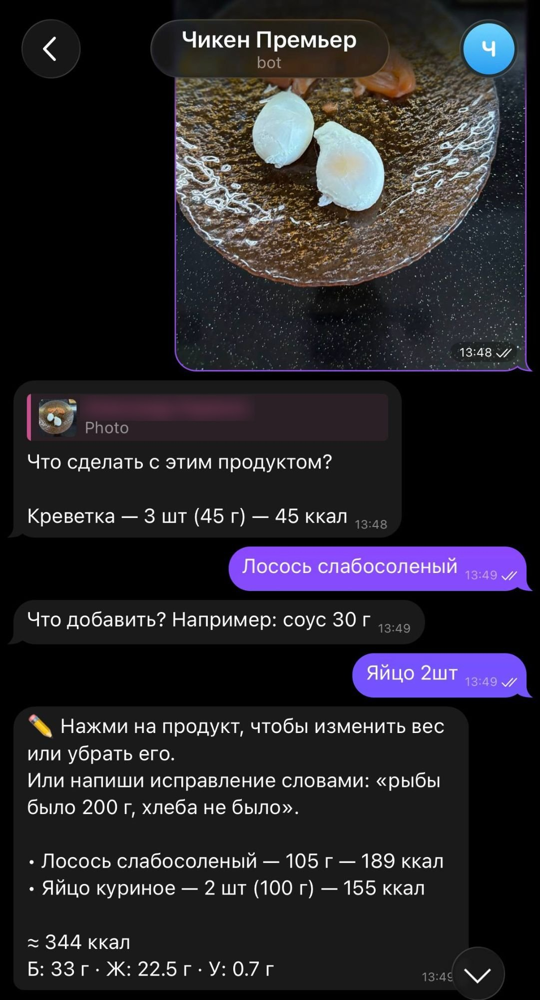
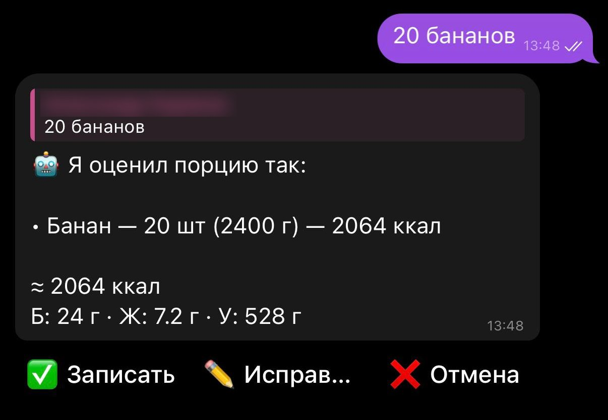
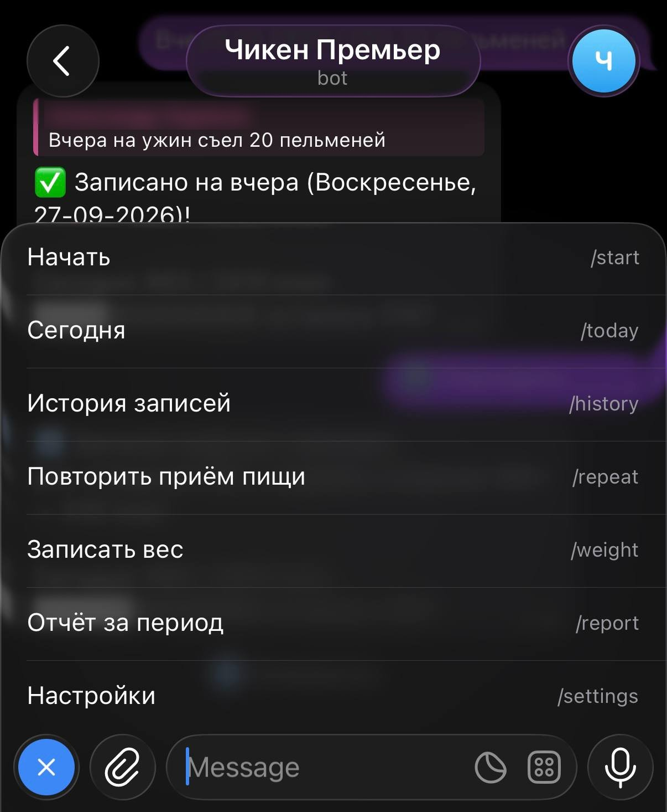

# 🐔 Chicken Premiere Bot

[](https://github.com/Yxsxo/Chicken_Premiere_bot/actions/workflows/tests.yml)

Telegram-бот для учёта питания. Пишешь, что съел, обычными словами — бот сам разложит еду на продукты, оценит граммы, посчитает калории и БЖУ и сохранит запись.

👉 **Попробовать:** [@Chicken_Premier_Bot](https://t.me/Chicken_Premier_Bot)

<p>
  
  
  
</p>

*Слева направо: фото еды и редактор позиций · оценка порции · запись «вчера» и команды.*

## Что умеет

- **Разбор еды свободным текстом** — «на обед гречка с курицей и салат» → список продуктов с граммами, калориями, белками, жирами и углеводами. Можно указать граммы самому или доверить оценку боту.
- **Фото еды** — пришли снимок тарелки, бот распознает продукты и оценит порции.
- **Редактор перед записью** — поправь вес любого продукта (КБЖУ пересчитаются), убери лишнее, добавь забытое или просто напиши «рыбы было 200 г, хлеба не было».
- **Приёмы пищи** — завтрак / обед / ужин / перекус определяются по словам в сообщении или по времени.
- **Задним числом** — «вчера на ужин пицца» запишется на вчера.
- **Итог за день** — прогресс-бар до дневной нормы, калории и БЖУ.
- **История** — последние записи с составом: изменить состав, приём пищи, повторить или удалить (с подтверждением).
- **Повтор** — частые блюда в одно касание, с возможностью отменить.
- **Дневная норма и цель по белку** — ввести вручную или рассчитать по формуле Миффлина — Сан Жеора (вес, рост, возраст, пол, активность, цель).
- **Вес** — запись, изменение за неделю и месяц, график.
- **Отчёты** — за неделю, месяц или свой период, текстом или графиком.
- **Умные напоминания** — вечером итог дня, а если записей нет — напоминание; по понедельникам — взвеситься.
- **Быстрая запись** — просто отправь число, например `450`, и бот запишет калории.

## Команды

| Команда | Что делает |
|---|---|
| `/start` | Приветствие и меню |
| `/today` | Итог за сегодня |
| `/history` | Последние записи |
| `/repeat` | Повторить частый приём пищи |
| `/weight` | Вес: тренд, график, новая запись |
| `/report` | Отчёт за период |
| `/settings` | Норма калорий и время напоминания |

## Стек

- Python, [pyTelegramBotAPI](https://github.com/eternnoir/pyTelegramBotAPI)
- Anthropic API (Claude Haiku 4.5) — разбор еды, ответ строго в JSON
- SQLite — хранение записей
- APScheduler — напоминания, matplotlib — графики

## Как запустить локально

Нужен Python 3.10+.

1. Скачай проект:
   ```bash
   git clone https://github.com/Yxsxo/Chicken_Premiere_bot.git
   cd Chicken_Premiere_bot
   ```
2. Создай виртуальное окружение и установи зависимости:
   ```bash
   python -m venv .venv
   .venv\Scripts\activate
   pip install -r requirements.txt
   ```
   (на macOS/Linux активация: `source .venv/bin/activate`)
3. Получи ключи:
   - токен бота — у [@BotFather](https://t.me/BotFather) в Telegram;
   - ключ API — в [консоли Anthropic](https://console.anthropic.com/).
4. Скопируй `.env.example` в `.env` и впиши туда оба ключа.
5. Запусти:
   ```bash
   python bot.py
   ```
   На Windows можно просто дважды кликнуть `run_bot.bat`.

База `calories.db` создастся сама при первом запуске.

## Тесты

```bash
pip install -r requirements-dev.txt
pytest
```

Тесты не ходят ни в Telegram, ни в LLM: вместо них — заглушки ([tests/conftest.py](tests/conftest.py)), а база создаётся во временной папке. Кроме отдельных функций проверяются целые сценарии диалога: написать еду → оценить → поправить вес продукта → записать → проверить базу. Тесты запускаются автоматически на каждый push через GitHub Actions.

## Технические решения

- **LLM только распознаёт, арифметику делает код.** Модель возвращает продукты с КБЖУ в JSON, а итоги бот суммирует сам — модели ошибаются в сложении. Ответ модели проверяется: markdown вокруг JSON, числа строкой («216,5»), пропущенные поля не роняют бота, а мусор превращается в понятное «не получилось разобрать».
- **Правка веса без повторного запроса.** Изменил вес продукта в редакторе — калории и БЖУ пересчитываются пропорционально в коде: мгновенно и бесплатно. К LLM идём только за новым продуктом или правкой словами.
- **Черновик и защита от старых кнопок.** Результат разбора — черновик в состоянии диалога вместе с id сообщения, где он показан. Кнопки из других (устаревших) сообщений игнорируются, поэтому старый черновик нельзя случайно записать поверх нового.
- **Состояние диалога в SQLite, а не в памяти.** Перезапуск бота посреди редактирования ничего не ломает — важно для деплоя, где перезапуски обычное дело.
- **Потокобезопасность.** telebot обрабатывает сообщения в нескольких потоках, плюс поток напоминаний; доступ к общему соединению SQLite закрыт блокировкой. Графики строятся через `matplotlib.figure.Figure` в памяти — без глобального состояния pyplot и общих файлов.
- **Отказоустойчивость.** Таймаут и автоповторы запросов к LLM, понятное сообщение при недоступности с возможностью повторить, логи с ротацией в `bot.log`, любая непойманная ошибка обработчика логируется, а бот продолжает работать.
- **Часовой пояс явно.** «Сегодня», приёмы пищи и напоминания считаются в `BOT_TIMEZONE`, а не по часам сервера (на хостинге обычно UTC).
- **Миграции без потери данных.** Новые таблицы и столбцы добавляются при запуске, если их нет, — старые базы продолжают работать.

## Структура

| Файл | Назначение |
|---|---|
| `bot.py` | Команды, сообщения, кнопки, черновик и редактор |
| `claude_client.py` | Запрос к LLM (текст и фото) и проверка JSON-ответа |
| `nutrition.py` | Итоги КБЖУ и пересчёт продукта под новый вес |
| `db.py` | Работа с базой SQLite |
| `state.py` | Состояние диалога (хранится в базе) |
| `formatting.py` | Тексты сообщений |
| `keyboards.py` | Инлайн-клавиатуры |
| `calc.py` | Расчёт нормы калорий и белка |
| `reports.py` | Отчёты и графики |
| `reminders.py` | Ежедневные напоминания |
| `clock.py` | Время в часовом поясе бота (`BOT_TIMEZONE`) |

Логи пишутся в `bot.log`.

## Планы

- [ ] Работа 24/7 на хостинге
